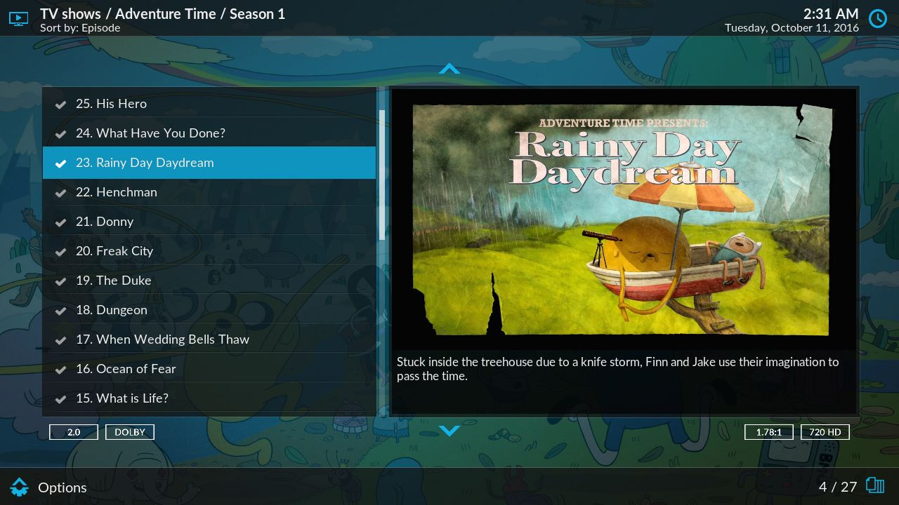

# Estuary multiple fanart mod

To go along with Artwork Helper, I've put together a quick and dirty modification of Estuary (from
just after Kodi 17 beta 3) that displays multiple fanart in the background. This is just a demo and example
for changes necessary for skins to integrate multiple artwork, it is **not for regular use**. This
modification affects the background fanart and prefers "parent" artwork like Container art or
`tvshow.fanart`, while the main fanart in the Fanart view stays the single `fanart` image from the
focused ListItem, which looks nice with episode fanart.

Skinners should take a look at the [changes for basic support] for changes required to
display this artwork on MyVideoNav/MyMusicNav, and the other [changes for home support] for
additional changes made for Home window support.

[changes for basic support]: https://github.com/rmrector/skin.estuary/compare/770b20...02ae52
[changes for home support]: https://github.com/rmrector/skin.estuary/compare/02ae52...f9afbf

**Hey, here's a screenshot of episode fanart!**

